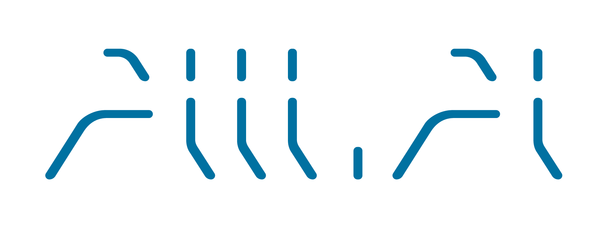

## MeetTaipeiDemo

    

This project is the demo for [2019 Meet Taipei](https://meettaipei.tw/)

## How to contribute
1. fork the repo
2. go to the forked repo and clone the project
3. change directory to the project
4. install dependencies `npm i`
5. Run `ng serve` for a dev server. Navigate to `http://localhost:4200/`. The app will automatically reload if you change any of the source files.
6. Run `ng build` to build the project. The build artifacts will be stored in the `dist/` directory. Use the `--prod` flag for a production build.

## Further help

please open an issue, then we will fix the problem soon, thanks.